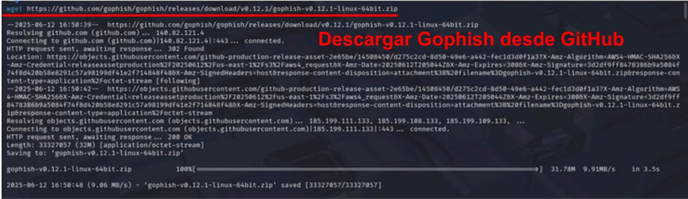
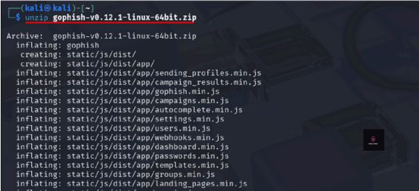
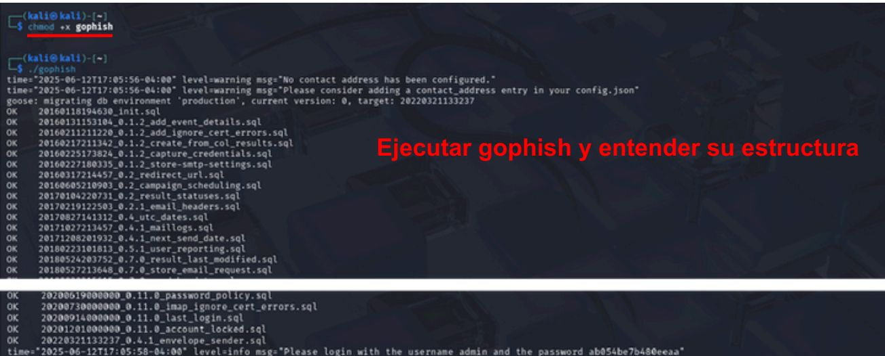
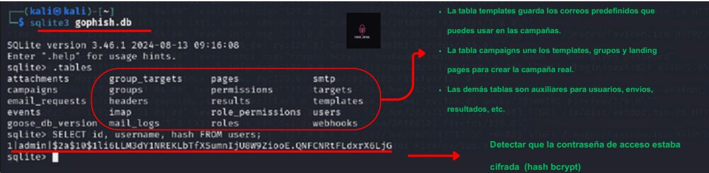
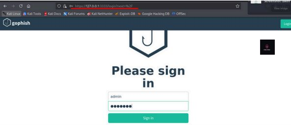
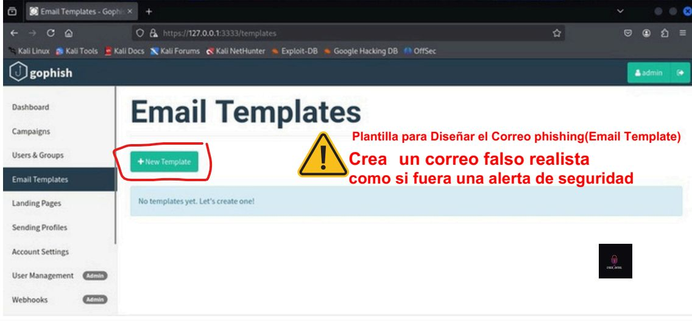

# 💌 Exploración de Gophish– Plantillas de Correo de Phishing(Email Templates) 🎣

En ciberseguridad educativa, practicar correos 'trampa' nos permite entender cómo los engaños por email funcionan, sin poner en riesgo datos reales.

Hoy me he centrado en 'Gophish', concretamente en su sección de ‘plantillas de correo’.

🎯 Esta es la base de cualquier campaña de phishing: aprender a diseñar emails que simulan intentos de engaño de manera segura.

📌 Objetivo: Mostrar cómo se si generan correos de “mentira”, para concienciar sobre los riesgos y enseñar técnicas defensivas. 

En la vida real, los emails de phishing pueden incluir malware: adjuntos peligrosos, enlaces a descargas maliciosas, o macros en documentos.

instalación de la herramienta: 

 ```
git clone https://github.com/gophish/gophish.git

 ```













